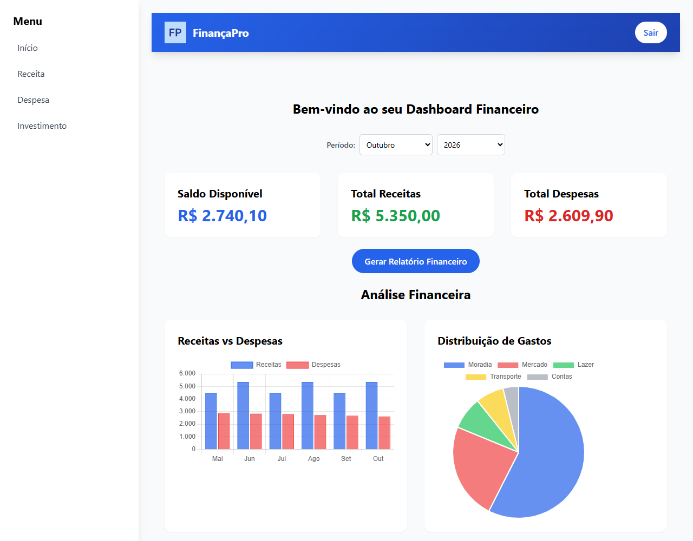

# FinPro

Controle financeiro pessoal feito em Python e Flask: receitas, despesas e carteira de investimentos, com gráficos, filtro por período e exportação para Excel.

**[Ver online](https://finpro-flo8.onrender.com)** · entre com a conta demo: usuário `demo`, senha `demo123`

> O app roda num servidor gratuito do Render. O primeiro acesso pode levar até 1 minuto, e os dados podem ser reiniciados quando o servidor reinicia.



## Funcionalidades

- Cadastro e login, com a senha guardada em hash (Werkzeug)
- Receitas e despesas: adicionar, editar e excluir
- Carteira de investimentos com rentabilidade por ativo
- Dashboard com saldo, receitas x despesas por mês e gastos por categoria
- Filtro por mês e ano em todas as telas
- Relatório em Excel com uma aba para cada tipo de lançamento
- Cada usuário só vê e altera os próprios dados

## Tecnologias

Python · Flask · SQLite · pandas e openpyxl · Chart.js · Tailwind CSS · pytest · Render

## Como rodar

```bash
git clone https://github.com/sabrinasiilva/FinPro.git
cd FinPro
python -m venv venv
venv\Scripts\activate          # Windows
# source venv/bin/activate     # Linux/macOS
pip install -r requirements.txt
python app.py
```

Acesse http://127.0.0.1:5000. O banco (`database.db`) é criado na primeira execução, já com a conta demo.

### Variáveis de ambiente

| Variável | Para quê | Padrão |
|---|---|---|
| `SECRET_KEY` | Assina a sessão de login. **Defina em produção.** | Gerada a cada vez que o app sobe |
| `DATABASE_PATH` | Caminho do arquivo SQLite | `database.db` na pasta do projeto |
| `FINPRO_DEMO` | `0` desliga a conta demo | `1` |
| `FLASK_DEBUG` | `1` liga o modo debug ao rodar `python app.py` | Desligado |

## Testes

```bash
pip install -r requirements-dev.txt
pytest
```

Os testes cobrem login, permissões entre usuários, edição de lançamentos, filtro por período, relatório em Excel, formatação de valores e a conta demo.

## Estrutura

```
app.py          rotas, regras e acesso ao banco
init_db.py      cria as tabelas à mão (o app já faz isso ao iniciar)
templates/      páginas em Jinja2 + Tailwind
static/css/     estilos do login e do cadastro
tests/          testes com pytest
```

## Deploy

O Render roda `gunicorn app:app` (ver `Procfile`). Defina `SECRET_KEY` nas variáveis de ambiente do serviço para o login continuar válido entre reinícios.

---

Feito por [Sabrina Silva](https://sabrinasiilva.github.io/Meu-Portifolio/).
